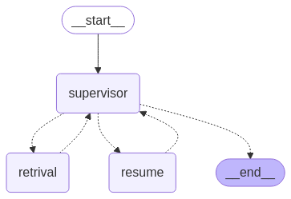

# AI Job Agent - Multi-Agent System

This project implements an AI Job Agent using a multi-agent approach. It leverages LangChain and LangGraph to create a system that can understand user job search requests, retrieve relevant job using RAg pipeline or web search and resume information, and provide career advice.

## Architecture

The system follows a multi-agent architecture as depicted in the image:



* **Supervisor Agent (Supervisor):** This agent acts as the orchestrator. It interprets user requests, autonomously asks for further information if needed, breaks down the request into tasks, and directs the flow between the Retrieval Agent and Resume Agent.
* **Retrieval Agent:** Responsible for retrieving relevant job listings and market insights using a RAG pipeline backed by a vector database (Weaviate). If no relevant data is found internally, it falls back to web search via the Tavily API.   
* **Resume Agent:** This agent provides career advice on tailoring resumes and can update resumes based on job market trends foud by the Retrival agent.


## Examples

### 🔍 **RAG Example**

**Query:**

> AI/ML software engineer in California requiring only a Bachelor’s degree in Computer Science
> **Filters:** `[]`

**Result:**
We found an exciting opportunity for an AI/ML Software Engineer position in California that requires only a Bachelor's degree in Computer Science. Here it is:

1. Snowflake is looking for a Software Engineer - AI/ML Frontend to join their team in San Mateo, CA. The role requires a Bachelor's degree in Computer Science, Engineering, or a related field, and 2 years of experience in software development, product engineering, or a related role. The ideal candidate will have proficiency in JavaScript/TypeScript and another language such as Python/Go/Java, as well as experience with React web development library. [Job Description](https://www.indeed.com/viewjob?jk=1a632c9fe83827ce)

This job posting matches your query, and we hope you find it interesting. Please note that the job requirements and details can be found on the provided job URL.

---

### 🌐 **Agent Example with Google Search (Tavily API)**

*[See the agent.md file](AGENT.md)
.*

---


## Technology Stack

| Category           | Tools & Libraries                                                    |
| ------------------ | -------------------------------------------------------------------- |
| LLM Framework      | LangChain Core, LangGraph                                            |
| Integrations       | LangChain Community, LangChain Groq, LangChain Experimental          |
| Search & Retrieval | Weaviate (vector DB), Tavily API (web search), Sentence Transformers |
| Job Scraping       | Python Jobspy                                                        |
| Web Server         | Flask                                                                |
| ML/AI              | Torch                                                                |
| Data Handling      | Pandas                                                               |

---

## Getting Started

1.  **Clone the repository:**

    ```bash
    git clone <repository_url>
    cd job-agent
    ```

2.  **Install dependencies:**

    ```bash
    pip install -r requirements.txt
    ```

3.  **Set up environment variables:**

    * `WEAVIATE_URL`: URL of your Weaviate instance.
    * `WEAVIATE_API_KEY`: API key for your Weaviate instance (if applicable).
    * `GROQ_API_KEY`: API key for Groq platform (if using Groq).
    * Other necessary API keys or configurations.

4.  **Run the application:**

    ```bash
    python main.py
    ```

    The application will start a Flask server, and you can interact with the AI Job Agent through the API endpoints.

## Entry Point

The main entry point for the application is `main.py`. This file initializes the agents, sets up the LangGraph workflow, and starts the Flask server.


## Contributing

Contributions are welcome! Please submit a pull request or open an issue for any bugs or feature requests.

## License

This project is licensed under the MIT License - see the [LICENSE](LICENSE) file for details.

## Contact

Seif Khelifi
khelifiseif1@gmail.com


* 
